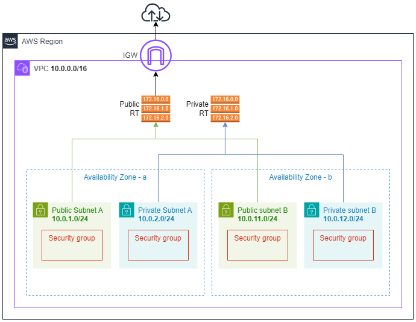
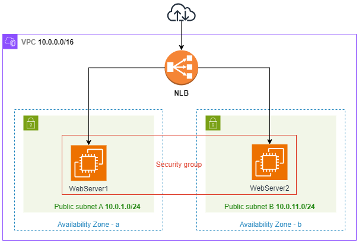
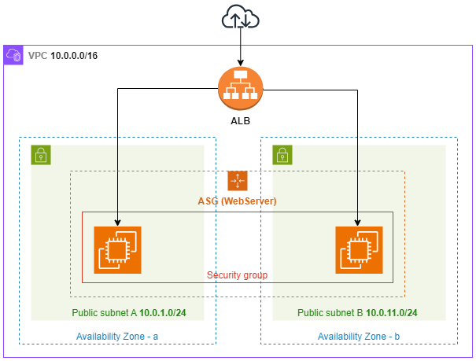

MDC Workshop

# Provisionamento de uma Arquitetura básica de Redes (VPC) e Load Balancer (NLB; ALB+ASG) na AWS

## AWS Networking

**Desenho da Arquitetura**

### Passo 01: Criar uma VPC

### Passo 02: Criar as Subnets (pub/priv)

### Passo 03: Internet Gateway

### Passo 04: Criar as Route Tables (pub/priv)

## Elastic Load Balancer (NLB): implantação com 2 instâncias em alta disponibilidade

**Desenho da Arquitetura**

### Passo 01: Criar instâncias EC2 (Elastic Compute Cloud)

### Passo 02: Criar um Load Balancer (NLB)

### Passo 03: Validar Load Balancer

## Aplication Load Balancer (ALB) com Auto Scaling Group (ASG)

**Desenhho da Arquitetura**

### Passo 01: Criar um Aplication Load Balancer (ALB)

### Passo 02: Criar um Auto Scaling Group (ASG)
